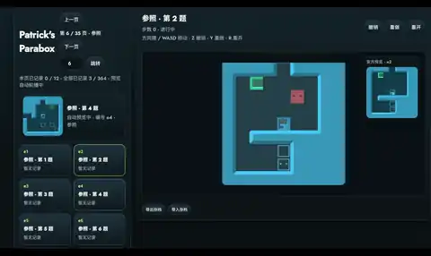

# Patrick's Parabox Demake

出于个人兴趣与学习目的，尝试用纯静态 HTML + Canvas + ESM 复现 [Patrick's Parabox](https://www.patricksparabox.com/) 的核心玩法。项目不依赖任何构建工具或 npm，用任意 HTTP 服务器打开 `index.html` 即可体验。

👉 **[在线游玩](https://patrick-demake.netlify.app/)** — 已部署至 Netlify，打开即玩。

> **声明**：本项目仅为个人学习与练习之用，绝非官方作品，亦不用于任何商业目的。原始游戏的全部知识产权归 Patrick Traynor 所有。

## 目录

- [在线游玩](#在线游玩)
- [实际演示](#实际演示)
- [快速启动](#快速启动)
- [自定义关卡与回放](#自定义关卡与回放)
- [项目结构](#项目结构)
- [操作](#操作)
- [技术要点](#技术要点)
- [缺失功能（已知）](#缺失功能已知)
- [许可](#许可)

## 在线游玩

项目已部署至 Netlify，无需本地启动，直接在浏览器中体验：

**🔗 https://patrick-demake.netlify.app/**

## 实际演示

<p align="center">
  
</p>

## 快速启动

### 方式一：本地服务器

```bash
# 任意 HTTP 服务器即可，例如：
npx serve .            # Node.js
python -m http.server  # Python
# 或 VS Code Live Server 右键打开 index.html
```

### 方式二：双击即玩

直接双击 `index-standalone.html` 即可运行，无需任何服务器。该文件将所有 JS/CSS/游戏数据内联为单一自包含文件（约 3.2 MB）。

用 `node scripts/build-standalone.js` 重新生成。

## 自定义关卡与回放

本项目不提供浏览器内置关卡编辑器，只兼容 Parafox / 官方格式导出的 `version 4` 文本关卡。推荐使用外部编辑器制作关卡：

- [Parafox GitHub 仓库](https://github.com/iwVerve/Parafox)
- [Parafox Releases 下载](https://github.com/iwVerve/Parafox/releases)
- [Patrick's Parabox 官方自定义关卡说明](https://www.patricksparabox.com/custom-levels/)

左侧“导入关卡/包”支持手动导入以下文件：

- `.txt` / `.bytes`：单个 Parafox `version 4` 文本关卡。
- `.zip`：包含多个 `.txt/.bytes` 的关卡包；zip 内的 `.png`、说明文档等非关卡文件会被忽略。
- `.json`：本站导出的自定义关卡包，可用于备份或在浏览器之间迁移。

浏览器不会自动扫描本地目录。仓库里的 `custom_world/` 仅作为本地关卡包素材目录使用，并已加入 `.gitignore`；若要游玩其中内容，需要在网页里手动选择具体文件，或先把关卡打成 zip 后导入。

导入后的自定义关卡会保存到当前浏览器的 `localStorage`，并追加到官方选关页之后。刷新页面、重启本地服务器后仍会保留；换浏览器、换域名或清理站点数据后不会自动存在。

自定义关卡导出格式为：

```json
{
  "version": 1,
  "title": "Custom Levels",
  "levels": [
    {
      "id": "custom:<hash>",
      "name": "level-name",
      "text": "version 4\n#\n..."
    }
  ]
}
```

通关记录会保存 `levelId + levelHash` 和输入日志，因此同名关卡内容变更后不会误用旧回放。hash 不一致时，旧回放会保留但不会自动挂到新关卡上。

删除规则：

- 官方关卡只支持删除记录。
- 自定义关卡支持“删记录”：只清理该关卡的回放/最优步数，保留关卡文本。
- 自定义关卡支持“删关卡”：删除关卡文本，并同时清理该关卡相关记录。

## 项目结构

```
├── index.html            # 入口
├── src/
│   ├── app/
│   │   ├── main.js       # 启动逻辑
│   │   └── styles.css    # 样式
│   ├── core/
│   │   ├── engine.js     # 规则引擎（移动、进入、退出、占据等）
│   │   ├── model.js      # 数据模型（GameState/Level/Block/Floor）
│   │   └── script-runner.js  # Headless 脚本执行器
│   ├── parser/
│   │   ├── level.js      # .bytes 关卡解析器
│   │   ├── resources.js  # 游戏数据库加载（puzzle_data/palettes/localization）
│   │   ├── localization.js   # 本地化 CSV 解析
│   │   └── invariant.js  # 工具函数（clamp/hsvToRgb/lerp）
│   ├── render/
│   │   └── canvas-renderer.js  # Canvas2D 渲染器
│   └── runtime/
│       ├── controller.js     # UI 控制、输入路由、回放
│       ├── custom-levels.js  # Parafox 自定义关卡导入、导出、zip 读取
│       └── records.js        # v2 记录与回放持久化
└── game-data/
    ├── levels-bundle.json           # 370 关卡数据
    ├── textures-sheet.png           # 纹理精灵表
    ├── textures-manifest.json       # 纹理坐标清单
    ├── level_thumbnails-sheet.png   # 缩略图精灵表
    ├── level_thumbnails-manifest.json
    ├── fonts/                       # Jost + Inconsolata 字体
    ├── wall_big_data.bytes          # 大墙四分块数据
    └── *.bytes                      # 游戏数据库文件
```

## 操作

| 按键 | 功能 |
|------|------|
| 方向键 / WASD | 移动 |
| Z | 撤销 |
| Y | 重做 |
| R | 重开 |

## 技术要点

- **零依赖**：纯 HTML + CSS + ES Modules，浏览器原生运行，无需任何构建步骤
- **规则引擎**：尽力还原 C# `Movement.cs` 递归移动系统（Slide / Enter / Exit / Push / Eat / Possess / Nudge / Shed / InnerPush / Inf）
- **渲染**：Canvas2D，autotile 墙壁、块边框、无穷效果、精灵表纹理
- **关卡数据**：370 个 shipped 关卡，合并为单一 JSON bundle
- **自定义关卡**：兼容 Parafox `version 4` 文本关卡，支持多文件、JSON 包与 zip 包导入
- **回放记录**：记录输入日志与关卡 hash，关卡内容变更时不会自动播放旧回放
- **字体**：Jost Demake（UI）+ Inconsolata Demake（等宽）

## 缺失功能（已知）

受限于个人能力与精力，以下功能尚未完整实现：

- 关卡传送门过渡（JS 无场景切换概念）
- Possess 占据动画幻影（仅视觉）
- InfExit 预览箭头（仅视觉）
- FlipShine 完整动画（当前为静态近似）
- DrawFace 眨眼动画
- 部分 specialEffect 值未使用

## 许可

本项目源代码以 [MIT License](https://opensource.org/licenses/MIT) 开源。

`game-data/` 目录下的关卡数据、纹理、字体等资源均为原始游戏 Patrick's Parabox 的资产，版权归 © Patrick Traynor 所有，此处仅用于学习与研究目的，请勿用于商业用途。

如果你喜欢原作，请务必前往 [Steam](https://store.steampowered.com/app/1260520/Patricks_Parabox/) 购买支持！
